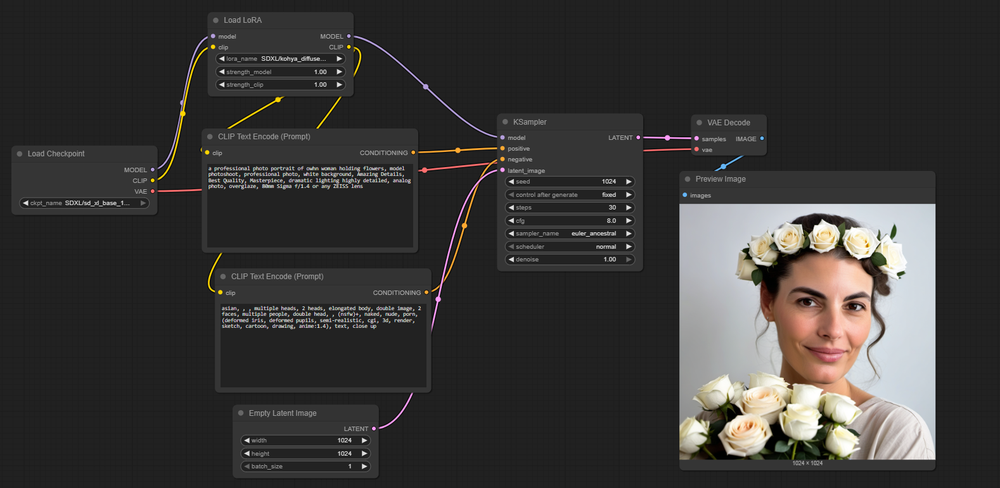

# AI Avatar Project
A project to practice training and fine-tuning Stable Diffusion models using techniques such as Textual Inversion, DreamBooth, and LoRA with [Diffusers](https://github.com/huggingface/diffusers) and [Kohya_ss](https://github.com/bmaltais/kohya_ss)

## Training code 
The training code is designed to be run on Kaggle.  
Simply execute each cell in order and adjust the parameters as needed.

## Inference 
The inference process is provided as a ComfyUI workflow in JSON format. To run it, follow these steps:

1. Install ComfyUI by following the instructions at [ComfyUI GitHub](https://github.com/comfyanonymous/ComfyUI).
2. Click the **Workflow** button in ComfyUI, select **New**, and load the provided `.json` workflow file.

## Workflow
A sample workflow file [`infer_irit.json`](./workflow/ZenID_combineFace.json) is included in the `workflow` folder for easy setup.
